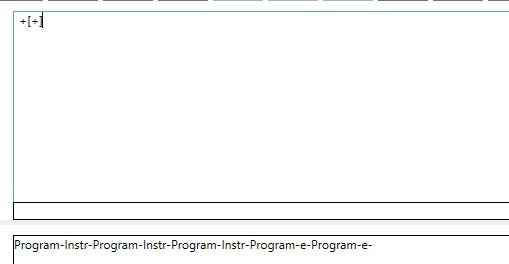
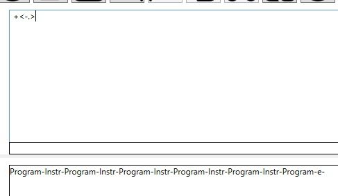
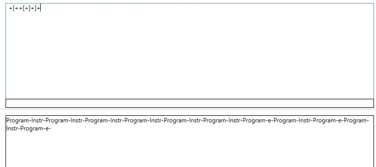

# Реализация метода рекурсивного спуска для синтаксического анализа.


## Грамматика
```
G[Program]:
1. Program -> ε | Instr Program
2. Instr -> '+' | '-' | '>' | '<' | ',' | '.' | '[' Program ']'
```
Грамматика является Контекстно свободной

## Тестовые примеры



