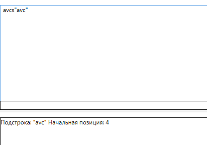
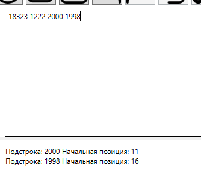
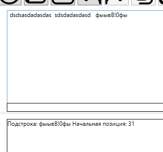

#Лабараторная работа №6 по ТФИЯК

Регулярные выражения:
```
\"[^"]*\"

(199[89])|(200[0-4])

/(?=.*[0-9])(?=.*[#?!|\@\$%\^&*\-_])(?=.*[а-я])(?=.*[А-Я])[0-9а-яА-Я#?!|\@\$%\^&*\-_]{8,}/g
```

Тестовые примеры:






